# Doors XP

*A Cook, Serve, Delicious-style typing game set on a Windows XP desktop.*

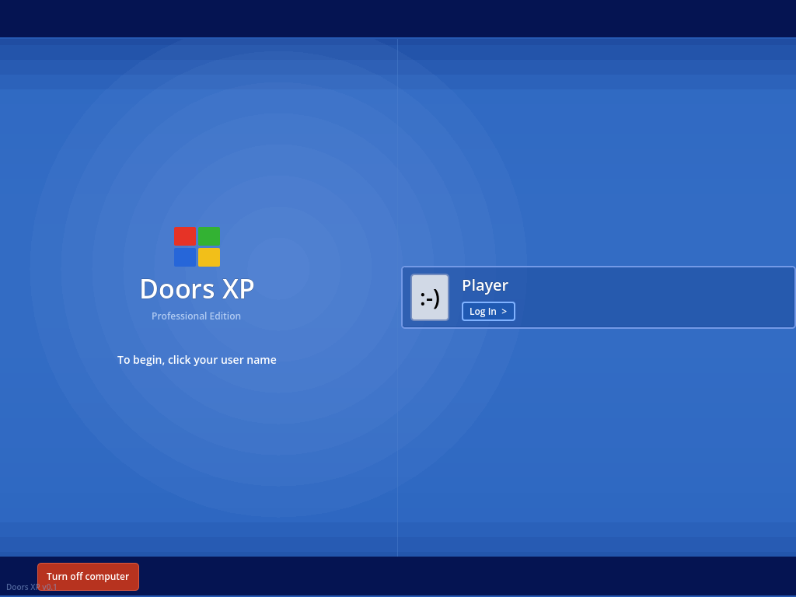

You're the new IT worker. Tasks flood your taskbar — emails to read, documents to print, viruses to quarantine, hard drives to defrag. Press the right keys in the right order, keep your boss happy, and survive your shift.

Built with **Godot 4.6** (GDScript). All UI drawn programmatically — no sprite assets needed.

---

## How It Plays

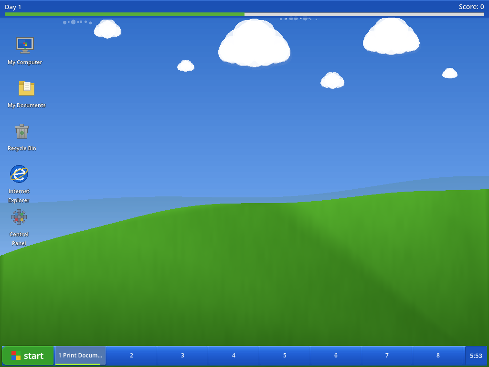

Tasks spawn on your taskbar throughout the day. Press **1-8** to open a task, then follow the key prompts to complete it step by step.

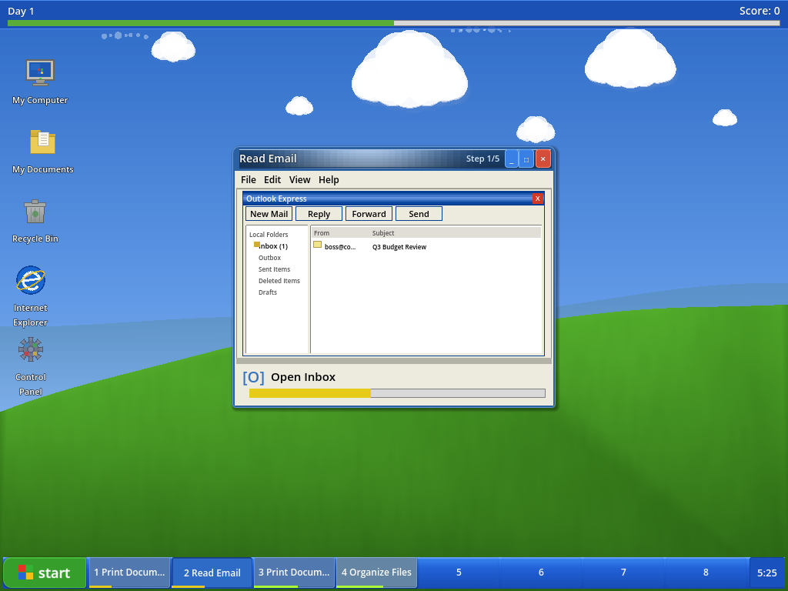

Each task type has its own visual — Outlook Express for emails, a Word doc for printing, a Security Alert for viruses. Every step shows you which key to press next.

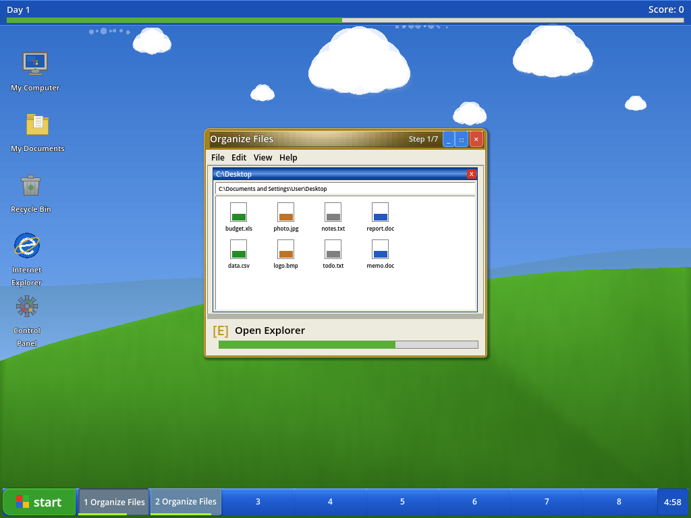

Some steps are timed waits: the printer needs to spool, the antivirus needs to scan, the defrag needs to run. You can't rush the machine.

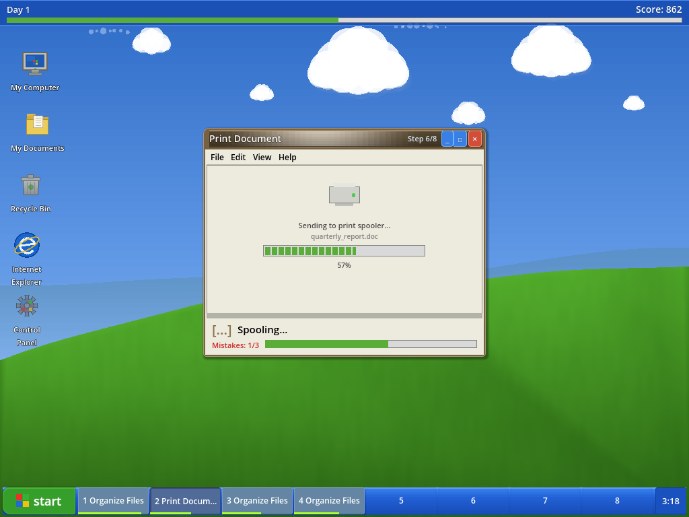

Complete tasks in a row to build your combo multiplier. Perfect runs (zero mistakes) earn a 1.5x bonus.

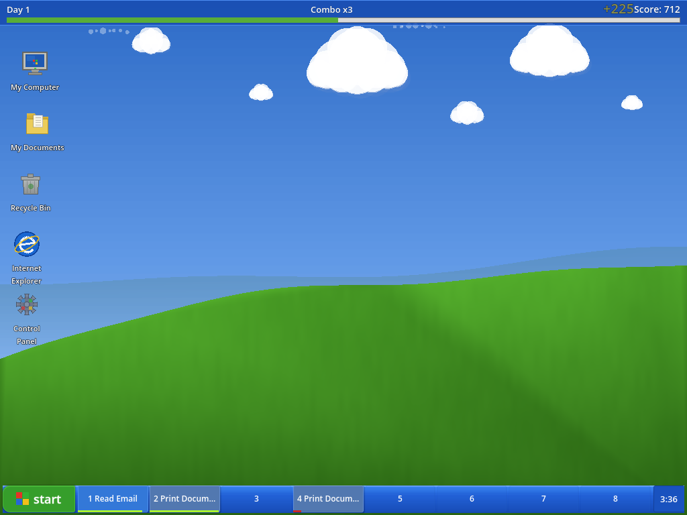

---

## 7 Task Types

| Task | Difficulty | What You're Doing |
|------|-----------|-------------------|
| **Read Email** | Easy | Open Outlook Express, read, reply, send |
| **Print Document** | Easy | Open doc, File > Print, select printer, wait for spooler |
| **Organize Files** | Easy | Open Explorer, select all, cut, paste, confirm |
| **Virus Alert** | Medium | Acknowledge threat, open antivirus, scan, quarantine, delete |
| **Install Software** | Medium | Insert CD, run setup, accept EULA, install, reboot |
| **Defrag HDD** | Medium | Open My Computer, right-click, defrag, wait, done |
| **Blue Screen Fix** | Hard | The big one. Long sequence, long waits, high reward |

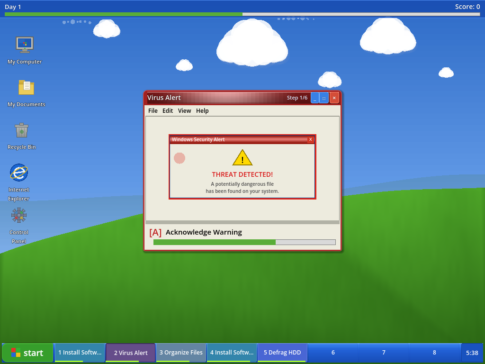

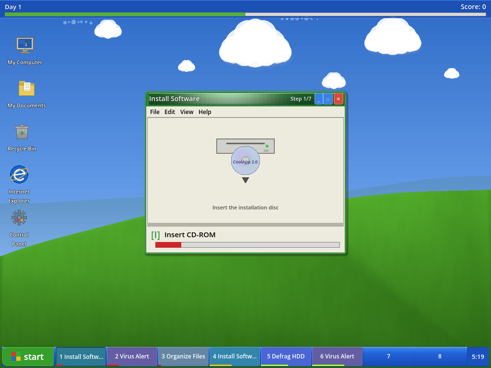

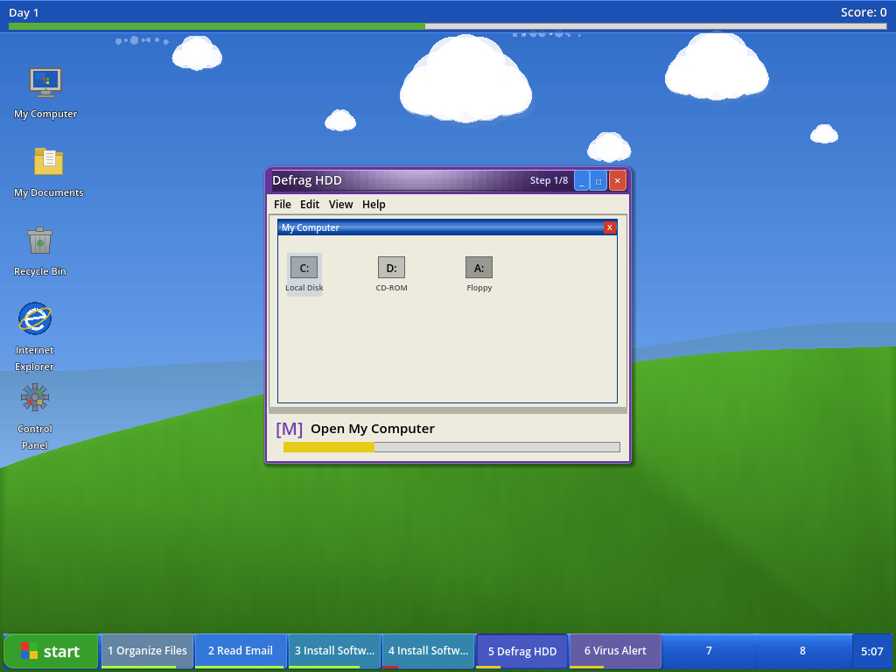

---

## Shift Structure

Each work day is **6 minutes**. Tasks spawn faster as the day goes on, with a rush hour in the middle third. After each shift, a summary shows your stats.

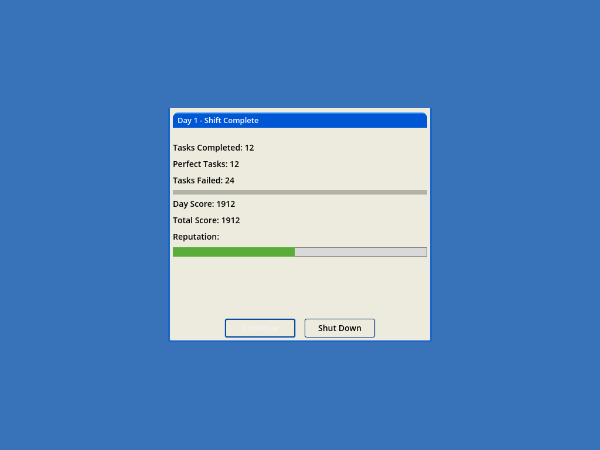

Difficulty scales across days: more tasks, shorter timers, harder task types unlocked. Day 1 caps at 4 simultaneous tasks. By Day 3+, you're juggling 8.

Let your reputation drop too low and...

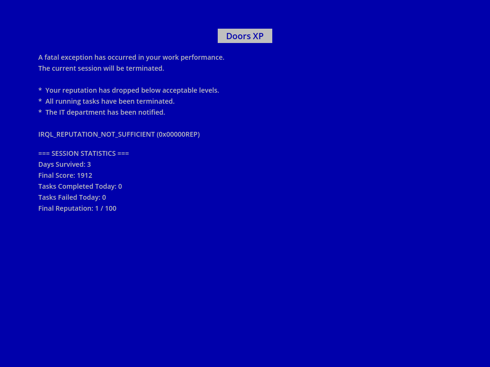

---

## Scoring

| Mechanic | Details |
|----------|---------|
| Base score | 80-250 points per task (harder = more) |
| Combo | +0.25x per consecutive completion, resets on fail |
| Perfect bonus | 1.5x multiplier for zero-mistake tasks |
| Reputation | Starts at 50/100, game over at 10 or below |

## Running

Open the project in **Godot 4.6** and run the main scene (`scenes/main_menu.tscn`).

## License

All rights reserved. VollkornGames.
